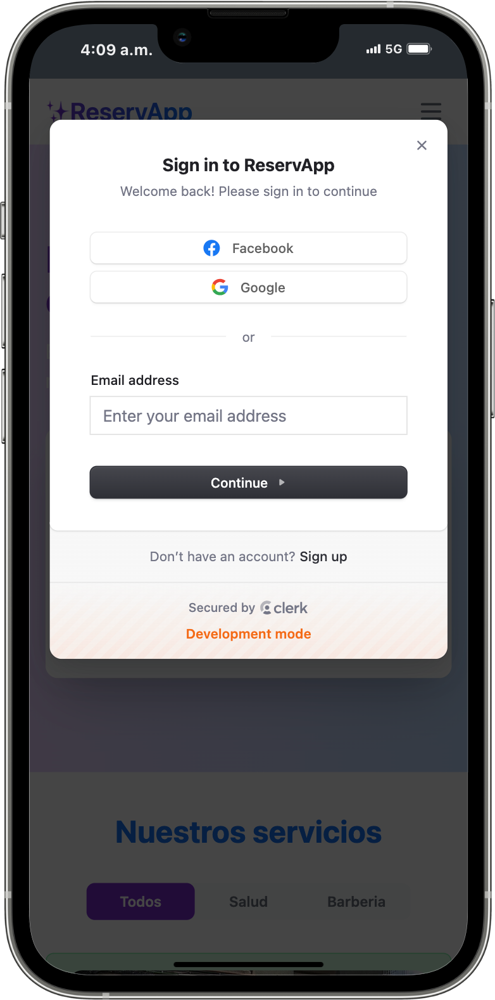
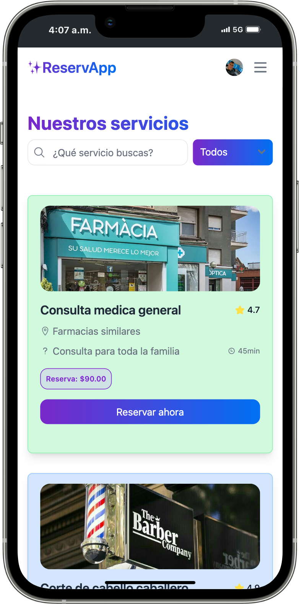
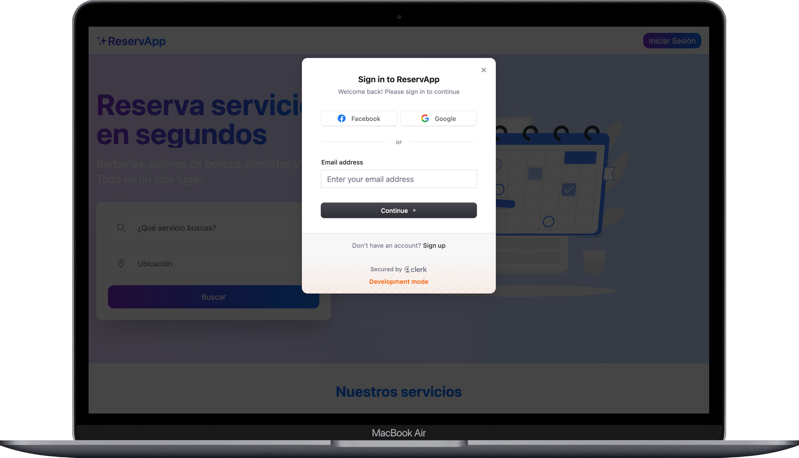
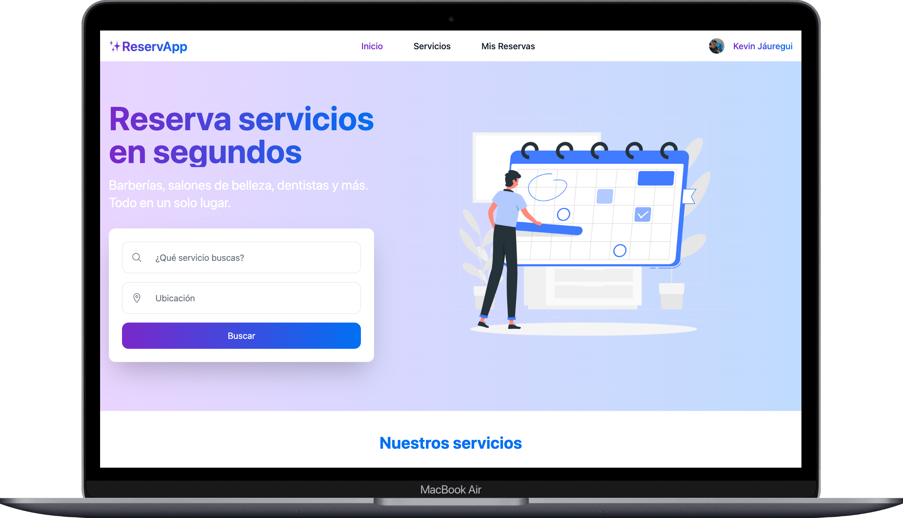

# 📅 ReservApp

[🌐 Ir a ReservApp](https://reservappclerk.netlify.app/) <!-- Cambia esta URL por la de tu app si es necesario -->

---

## 🎬 Demo en video

  <video src="./src/assets/demo.mp4" controls width="600">
    Tu navegador no soporta la reproducción de video.
  </video>

---

## 🖼️ Vistas previas de la aplicación

  
  
   
  
  

---

**ReservApp** es una aplicación web diseñada para permitir la reserva de servicios profesionales de forma automática, simple y eficaz.

---

## 💡 ¿Qué es ReservApp?

**ReservApp** ayuda a los profesionales a olvidarse de agendar manualmente citas, permitiéndoles enfocarse completamente en lo que mejor saben hacer: **su profesión**.

Tus clientes podrán ver tu disponibilidad y reservar fácilmente, mientras tú gestionas todo desde una interfaz moderna.

---

## 🧠 ¿Qué problema resuelve?

Muchos profesionales pierden tiempo valioso coordinando horarios con sus clientes. **ReservApp automatiza ese proceso**, eliminando fricciones en la agenda y mejorando la experiencia tanto para el profesional como para sus clientes.

---

## 👩‍⚕️ ¿Para quién es?

Para **todos los profesionales fantásticos** que ofrecen servicios y desean optimizar su tiempo. Algunos ejemplos:

- Psicólogos
- Terapeutas
- Consultores
- Abogados
- Entrenadores personales
- Freelancers en general

---

## 🔐 Requisitos de uso

Para poder hacer reservaciones, **debes ser un usuario autenticado**. La autenticación es gestionada de forma segura mediante [Clerk](https://clerk.dev).

---

## 🛠️ Tecnologías utilizadas

### 🧩 Frontend

- ⚛️ React
- 🎨 Tailwind CSS
- 🍞 React Toastify
- 🧼 Flowbite React
- 🧭 React Router DOM
- 📦 RTK Query

### 🛠️ Backend

- 🐘 PHP (Laravel)
- 🔌 API REST
- 🗃️ MySQL

### 🔐 Autenticación

- Clerk (gestión de usuarios, sesiones y autenticación segura)

---

## 🧪 Uso

Una vez autenticado, los usuarios pueden:

- Ver la disponibilidad de los profesionales.
- Agendar citas de forma automatizada.
- Consultar sus reservas desde su panel.

Los profesionales pueden:

- Establecer su disponibilidad.
- Visualizar y gestionar sus reservas.
- Recibir notificaciones del sistema.

---

ReservApp representa mucho más que una simple aplicación: es el resultado de mi primer gran reto como desarrollador fullstack. A lo largo de este proyecto he aprendido sobre tecnologías modernas, buenas prácticas y la importancia de crear soluciones que realmente ayuden a las personas a optimizar su tiempo y mejorar su día a día.

Cada línea de código, cada error y cada pequeño avance han sido oportunidades de crecimiento personal y profesional. Estoy convencido de que el aprendizaje constante es la clave para alcanzar cualquier meta, y ReservApp es la prueba de que con dedicación y pasión se pueden lograr grandes cosas, incluso empezando desde cero.

¡Gracias por tomarte el tiempo de conocer este proyecto! Espero que inspire a otros a lanzarse a crear, aprender y nunca dejar de mejorar.